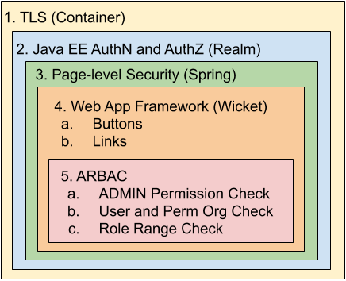

   Licensed to the Apache Software Foundation (ASF) under one
   or more contributor license agreements.  See the NOTICE file
   distributed with this work for additional information
   regarding copyright ownership.  The ASF licenses this file
   to you under the Apache License, Version 2.0 (the
   "License"); you may not use this file except in compliance
   with the License.  You may obtain a copy of the License at

     http://www.apache.org/licenses/LICENSE-2.0

   Unless required by applicable law or agreed to in writing,
   software distributed under the License is distributed on an
   "AS IS" BASIS, WITHOUT WARRANTIES OR CONDITIONS OF ANY
   KIND, either express or implied.  See the License for the
   specific language governing permissions and limitations
   under the License.

# README for Apache Fortress WEB Security Model


## Table of Contents

 * Document Overview
 * Understand the security model of Apache Fortress Web
 * SECTION 1. TLS
 * SECTION 2. Java EE security
 * SECTION 3. Spring security **FilterSecurityInterceptor**
 * SECTION 4. Apache Wicket Buttons and Links
 * SECTION 5. Apache Fortress Web **ARBAC Checks**
 * SECTION 6. Policy load

## Document Overview

 Provides a description of the various security mechanisms that are performed during Apache Fortress WEB runtime operations.
## Understand the security model of Apache Fortress Web

### A Typical Deployment

   (**Browser**)<---https--->(**FortressWeb**)<-in-process->(**FortressCore**)<---ldaps--->(**DirectoryServer**)

 * Consists of three tiers: 1. **Browser**, 2. Servlet Container hosting **FortressWeb**, and 3. **DirectoryServer** that stores the policy information.
 * **FortressWeb** is a web application archive (.war) that deploys into a Servlet Container, i.e. Apache Tomcat.
 * **FortressCore** is a set of APIs that get embedded inside of Java apps, FortressWeb and Fortress Rest.
 * **DirectoryServer** is a process implementing LDAPv3 protocols, e.g. ApacheDS or OpenLDAP.

### High-level Security Flow
 * The user credentials are introduced into the call chain by the Client as a standard HTTP basic auth header.
 * Passed into the Servlet Container for authentication and coarse-grained authorization before dispatch to FortressWeb.
 * Spring security verifies user has role to view the web page.
 * Medium-grained authorization performed inside the pages via Apache Wicket controls button and link visibility.
 * The RBAC session passed into the FortressCore for fine-grained checks.

### Apache Fortress Web security model includes:

### 1. TLS

 Be sure to use because it allows confidentiality of credentials and message content via HTTPS. Refer to the documentation of your servlet container for how to enable.

## 2. Java EE security

 * FortressWeb uses the [Apache Fortress Realm](https://github.com/apache/directory-fortress-realm) to provide Java EE authentication, coarse-grained authorization mapping the users and roles back to a given LDAP server.
 * This interface requires standard HTTP Basic Auth tokens for the userid/password credentials.
 * The credentials are verified by the Apache Fortress Realm via bind op invocation to the Directory Server.
 * The coarse-grained authorization policy ensures callers have been assigned at least one of the following roles to successfully navigate to any page:
    1. ROLE_ADMIN
    2. ROLE_USERS
    3. ROLE_ROLES
    4. ROLE_PERMS
    5. ROLE_SSDS
    6. ROLE_DSDS
    7. ROLE_POLICIES
    8. ROLE_PERMOBJS
    9. ROLE_USEROUS
    10. ROLE_PERMOUS
    11. ROLE_ADMINROLES
    12. ROLE_ADMINOBJS
    13. ROLE_ADMINPERMS
    14. ROLE_AUDIT_AUTHZS
    15. ROLE_AUDIT_MODS
    16. ROLE_AUDIT_BINDS
    17. ROLE_GROUPS
    
 * per its deployment descriptor, [web.xml](src/main/webapp/WEB-INF/web.xml).

## 3. Spring security **FilterSecurityInterceptor**

| Role Name         | USERS | ROLES | POBJS | PERMS | PWPOLICIES | SSDS  | DSDS  | USEROUS | PERMOUS | ADMINROLES | ADMPOBJS | ADMPERMS | GROUPS | BINDS | AUTHZ | MODS  |
| ----------------- | ----- | ----- | ------| ----- | ---------- | ----- | ----- | ------- | ------- | ---------- | -------- | -------- | -------| ----- | ----- | ----- |
| ROLE_RBAC_ADMIN   | true  | true  | true  | true  | true       | true  | true  | true    | true    | true       | true     | true     | true   | true  | true  | true  |
| ROLE_USERS        | true  | false | false | false | false      | false | false | false   | false   | false      | false    | false    | false  | false | false | false |
| ROLE_ROLES        | false | true  | false | false | false      | false | false | false   | false   | false      | false    | false    | false  | false | false | false |
| ROLE_PERMOBJS     | false | false | true  | false | false      | false | false | false   | false   | false      | false    | false    | false  | false | false | false |
| ROLE_PERMS        | false | false | false | true  | false      | false | false | false   | false   | false      | false    | false    | false  | false | false | false |
| ROLE_POLICIES     | false | false | false | false | true       | false | false | false   | false   | false      | false    | false    | false  | false | false | false |
| ROLE_SSDS         | false | false | false | false | false      | true  | false | false   | false   | false      | false    | false    | false  | false | false | false |
| ROLE_DSDS         | false | false | false | false | false      | false | true  | false   | false   | false      | false    | false    | false  | false | false | false |
| ROLE_USEROUS      | false | false | false | false | false      | false | false | true    | false   | false      | false    | false    | false  | false | false | false |
| ROLE_PERMOUS      | false | false | false | false | false      | false | false | false   | true    | false      | false    | false    | false  | false | false | false |
| ROLE_ADMINROLES   | false | false | false | false | false      | false | false | false   | false   | true       | false    | false    | false  | false | false | false |
| ROLE_ADMINOBJS    | false | false | false | false | false      | false | false | false   | false   | false      | true     | false    | false  | false | false | false |
| ROLE_ADMINPERMS   | false | false | false | false | false      | false | false | false   | false   | false      | false    | true     | false  | false | false | false |
| ROLE_GROUPS       | false | false | false | false | false      | false | false | false   | false   | false      | false    | false    | true   | false | false | false |
| ROLE_AUDIT_BINDS  | false | false | false | false | false      | false | false | false   | false   | false      | false    | false    | false  | true  | false | false |
| ROLE_AUDIT_AUTHZS | false | false | false | false | false      | false | false | false   | false   | false      | false    | false    | false  | false | true  | false |
| ROLE_AUDIT_MODS   | false | false | false | false | false      | false | false | false   | false   | false      | false    | false    | false  | false | false | true  |

 * The page-to-role mappings are enforced by Spring security.

## 4. Apache Wicket Buttons and Links

 * All of the pages in this app have buttons and links that are protected by Apache Fortress Administrative Role-Based Access Control (ARBAC) permissions.  The way it works, when a user logs in, their ARBAC permissions are cached in the HTTP session.
 * When a button or link is loaded onto a page, the Web app will verify that the User has a corresponding ARBAC permission, and will display the control.  Otherwise, the button or link will not be loaded.  

 TODO: A list of ARBAC permissions being checked:
 

## 5. Apache Fortress **ARBAC Checks**

 * Administrative Role-Based Access Control (ARBAC) is a type of Delegated Administration.  
 * For an overview on Apache Fortress ARBAC: [Apache Fortress Rest Security Model](https://github.com/apache/directory-fortress-enmasse/blob/master/README-SECURITY-MODEL.md)
 * Disabled in Fortress Web by default, to enable, add the following declaration to the fortress.properties:

 ```
 is.arbac02=true
 ```

## 6. Policy load

 a. The [Policy load file](./src/main/resources/FortressWebDemoUsers.xml) is an ant script that creates the roles and permissions that this app checks during code execution.  This step is performed during setup as described in the project's setup documentation.
 
 b. Test Users 
 
| User Type   | UserID | USERS | ROLES | POBJS | PERMS | PWPOLICIES | SSDS  | DSDS  | USEROUS | PERMOUS | ADMINROLES | ADMPOBJS | ADMPERMS | GROUPS | BINDS | AUTHZ | MODS  |
| ----------- | ------ | ----- | ----- | ------| ----- | ---------- | ----- | ----- | ------- | ------- | ---------- | -------- | -------- | -------| ----- | ----- | ----- |
| Super Admin | test   | true  | true  | true  | true  | true       | true  | true  | true    | true    | true       | true     | true     | true   | true  | true  | true  |
| User Admin  | test1  | true  | false | false | false | false      | false | false | false   | false   | false      | false    | false    | false  | false | false | false |
| Auditor     | test2  | true  | false | false | false | true       | false | false | false   | false   | false      | false    | false    | true   | true  | true  | true  |
| Group Admin | test3  | false | false | true  | false | false      | false | false | false   | false   | false      | false    | false    | true   | false | false | false |

 * All test passwords = 'password' 

#### END OF README
