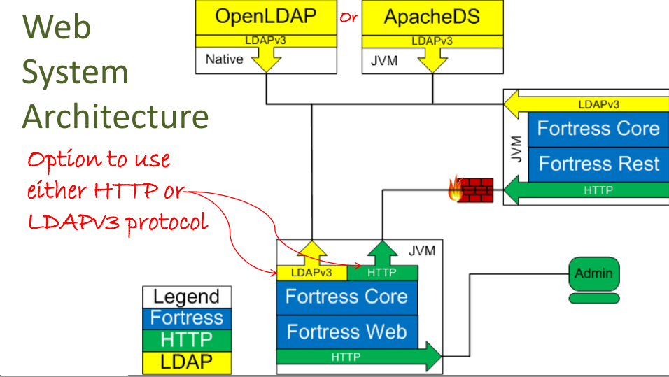

   Licensed to the Apache Software Foundation (ASF) under one
   or more contributor license agreements.  See the NOTICE file
   distributed with this work for additional information
   regarding copyright ownership.  The ASF licenses this file
   to you under the Apache License, Version 2.0 (the
   "License"); you may not use this file except in compliance
   with the License.  You may obtain a copy of the License at

     http://www.apache.org/licenses/LICENSE-2.0

   Unless required by applicable law or agreed to in writing,
   software distributed under the License is distributed on an
   "AS IS" BASIS, WITHOUT WARRANTIES OR CONDITIONS OF ANY
   KIND, either express or implied.  See the License for the
   specific language governing permissions and limitations
   under the License.

# README for Apache Fortress Web
 * Version 1.0.1
 * Apache Fortress Web System Architecture Diagram
 

-------------------------------------------------------------------------------
## Table of Contents

 * Document Overview
 * Tips for first-time users.
 * SECTION 1. Prerequisites
 * SECTION 2. Download & Install
 * SECTION 3. Get the fortress.properties
 * SECTION 4. Load Sample Security Policy
 * SECTION 5. Deploy to Tomcat Server
 * SECTION 6. Test with Selenium

___________________________________________________________________________________
## Document Overview

This document contains instructions to download, build, and test operations using Apache Fortress Web component.

___________________________________________________________________________________
##  Tips for first-time users

 * For a tutorial on how to use Apache Fortress check out the: [10 Minute Guide](http://directory.apache.org/fortress/gen-docs/latest/apidocs/org/apache/directory/fortress/core/doc-files/ten-minute-guide.html).
 * If you see **FORTRESS_CORE_HOME**, refer to the base package of [directory-fortress-core].
 * If you see **FORTRESS_REALM_HOME**, refer to the base package of [directory-fortress-realm].
 * If you see **FORTRESS_WEB_HOME**, refer to this packages base folder.
 * If you see **TOMCAT_HOME**, refer to the location of that package's base folder.
 * Questions about this software package should be directed to its mailing list:
   * http://mail-archives.apacheorg/mod_mbox/directory-fortress/

-------------------------------------------------------------------------------
## SECTION 1. Prerequisites

Minimum hardware requirements:
 * 2 Cores
 * 4GB RAM

Minimum software requirements:
 * Java SDK 7++
 * git
 * Apache Maven3++
 * Apache Tomcat7++
 * Apache Fortress Core **Download & Install** in **FORTRESS_CORE_HOME** package **README.md**.
 * Apache Fortress Core **Options for using Apache Fortress and LDAP server** in **FORTRESS_CORE_HOME** package **README.md**.
 * Apache Fortress Realm **Download & Install** in **FORTRESS_REALM_HOME** package **README.md**.

Everything else covered in steps that follow.  Tested on Debian, Centos & Windows systems.

-------------------------------------------------------------------------------
## SECTION 2. Download & Install

Build the source.

 a. from git:
 ```
 git clone --branch 1.0.1 https://git-wip-us.apache.org/repos/asf/directory-fortress-commander.git
 cd directory-fortress-commander
 mvn clean install
 ```

 b. or download package:

 ```
 wget http://www.apache.org/dist/directory/fortress/dist/1.0.1/fortress-web-1.0.1-source-release.zip
 unzip fortress-web-1.0.1-source-release.zip
 cd fortress-web-1.0.1
 mvn clean install
 ```

___________________________________________________________________________________
## SECTION 3. Get the fortress.properties

These contain the coordinates to the target LDAP server.

1. Copy the **fortress.properties**, created during **FORTRESS_CORE_HOME** **README.md**, to this package's resource folder.

 ```
 cp $FORTRESS_CORE_HOME/config/fortress.properties $FORTRESS_WEB_HOME/src/main/resources
 ```

2. Verify they match your target LDAP server.
 ```
 # This param tells fortress what type of ldap server in use:
 ldap.server.type=apacheds

 # ldap host name
 host=localhost

 # if ApacheDS is listening on
 port=10389

 # If ApacheDS, these credentials are used for read/write to fortress DIT
 admin.user=uid=admin,ou=system
 admin.pw=secret

 # This is min/max settings for admin pool connections:
 min.admin.conn=1
 max.admin.conn=10

 # This node contains more fortress properties stored on behalf of connecting LDAP clients:
 config.realm=DEFAULT
 config.root=ou=Config,dc=example,dc=com

 # Used by application security components:
 perms.cached=true

 # Fortress uses a cache:
 ehcache.config.file=ehcache.xml

 # Default for pool reconnect flag is false:
 enable.pool.reconnect=true
 ```

___________________________________________________________________________________
## SECTION 4. Load Sample Security Policy

Run maven install with load file:
```
mvn install -Dload.file=./src/main/resources/FortressWebDemoUsers.xml
```

___________________________________________________________________________________
## SECTION 5. Deploy to Tomcat Server

1. If Tomcat has global security enabled you must add credentials to pom.xml:

 ```
      <plugin>
        <groupId>org.codehaus.mojo</groupId>
        <artifactId>tomcat-maven-plugin</artifactId>
        <version>${version.tomcat.maven.plugin}</version>
        <configuration>
            ...
          <!-- Warning the tomcat manager creds here are for deploying into a demo environment only. -->
          <username>tcmanager</username>
          <password>m@nager123</password>
        </configuration>
      </plugin>
 ```

2. copy **FORTRESS_REALM_HOME** proxy jar to **TOMCAT_HOME**/lib/

 ```
 cp $FORTRESS_REALM_HOME/proxy/target/fortress-realm-proxy-[version].jar $TOMCAT_HOME/lib
 ```

3. Restart Tomcat server.

4. Enter maven command to deploy to Tomcat:
 ```
 mvn tomcat:deploy
 ```

5. To redeploy:
 ```
 mvn tomcat:redeploy
 ```

6. Open browser and test (creds: test/password):

 ```
 http://hostname:8080/fortress-web
 ```

___________________________________________________________________________________
## SECTION 6. Test with Selenium

Run the Selenium Web driver integration tests:
 ```
 mvn test -Dtest=FortressWebSeleniumITCase
 ```

 Note: These automated tests depend that:
 * Firefox installed to target machine.
 * **FORTRESS_CORE_HOME**/*FortressJUnitTest* successfully run.  This will load some test data to grind on.
 * [FortressWebDemoUsers](./src/main/resources/FortressWebDemoUsers.xml) policy loaded into target LDAP server.

___________________________________________________________________________________
#### END OF README